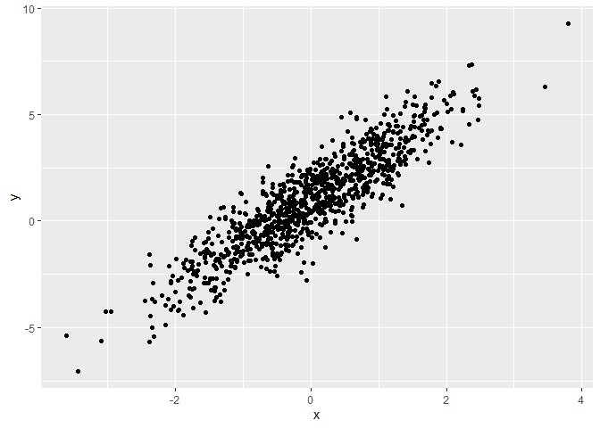
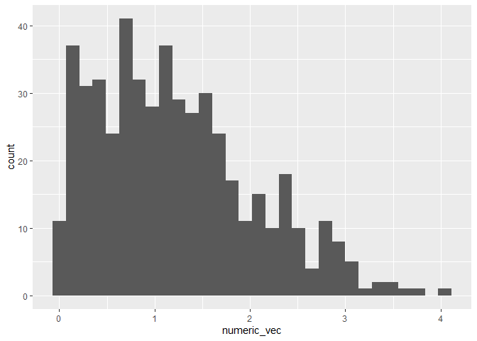

Simple document
================
Will Anderson
2022-09-13

<!-- toc: true
    toc_float: true
    code_folding: hide --> <!--
I'd like to save this text for later and don't want to delete it yet.
-->

<!-- echo suppresses the code in the formatted document, message suppresses all the library outputs, eval does not execute the code -->
<!-- to change to pdf you must type output: pdf_document -->

$y = mx + b$
<!-- good looking math equations use bookended dollar signs -->

# This is my own header

I’m an R Markdown document!

# Section 1

Here’s a **code chunk** that samples from a *normal distribution*:

``` r
samp = rnorm(100)
length(samp)
```

    ## [1] 100

# Section 2

I can take the mean of the sample, too! The mean is 0.076969.

# Section 3

This is going to make a plot! First I generate a dataframe, then use
ggplot to make a scatterplot Echo doesn’t show the code in output

``` r
plot_df=
  tibble(
    x=rnorm(n=1000),
    y=1+2*x+rnorm(n=1000)
  )

ggplot(plot_df,aes(x=x,y=y))+geom_point()
```

<!-- -->

    ## `stat_bin()` using `bins = 30`. Pick better value with `binwidth`.

<!-- --> The median
of the data is 1.08

``` r
mean1 = mean(my_tib$my_var)
median1 = median(my_tib$my_var)
stdev1 = sd(my_tib$my_var)
```

-   The mean is 1.0486656
    -   The median is 1.0753591
    -   The standard deviation is 1.0240892

\#Header1
